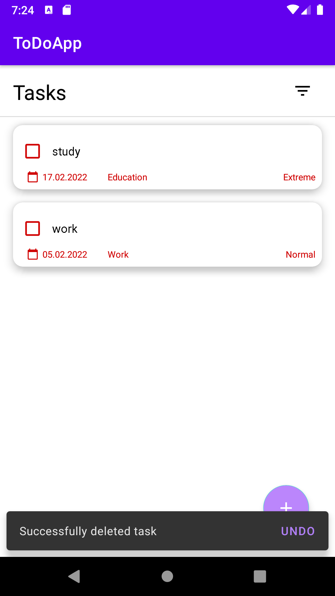

# ToDoApp

An android application that allows you to create a to-do list. Written in MVVM architecture, using Kodein as Dependency Injection. Other technologies used are: viewBinding, Room, Navigation Components.
The app also has tests written using: mockito, espresso, robolectric and google truth.

## Table of contents:
* [General info](#general-info)
* [Technologies](#technologies)
* [Illustrations](#illustrations)

## Technologies
Project is created with:
* Kotlin
* Android Studio
* Gradle
* Material Design
* Room
* Kotlin Extensions and Coroutines 
* ViewBinding
* Kodein
* Navigation Components
* Mockito
* Espresso
* Roboelectric
* Google truth

## Illustrations

 
 
 
 
 
 
 

